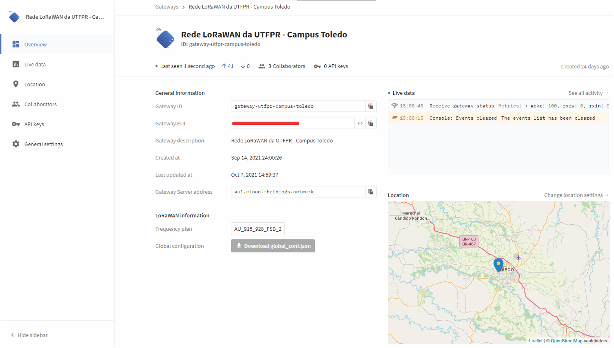
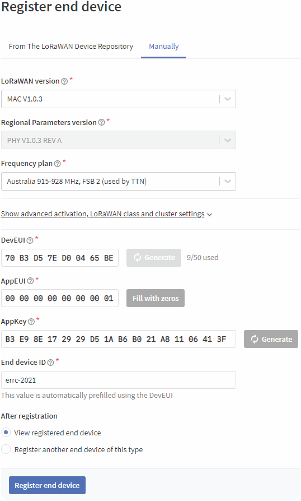

# Prática 2: Comunicação LoRaWAN com Servidor de Rede TTS

A comunicação com um servidor de rede TTS é possível utilizando o _gateway_ da Radioenge. O próprio fabricante disponibiliza um tutorial demonstrando como realizar a instalação do _firmware_ do _gateway_ e como registrá-lo na rede. Como a plataforma TTS sofreu mudanças somente o seu registro será abordado.

Acessando a [TTS](https://au1.cloud.thethings.network) é possível realizar o _login_, ou cadastro, na plataforma. Uma vez feita a autenticação o console é exibido apresentando as seções de aplicações e _gateways_. Para registrar um _gateway_ entramos na área dos _gateways_ e clicamos em _Add Gateway_. Neste momento três parâmetros devem ser configurados, _Gateway-ID_, _Gateway EUI_ e _Frequency Plan_. _Gateway-ID_ se refere a um identificador único que vai dar nome ao _gateway_. _Gateway EUI_ também é um identificador único do dispositivo, mas este é fornecido pelo fabricante. Já _Frequency Plan_ está relacionado ao plano de frequência a ser usado, no caso Australia 915-928 MHz, FSB2. O processo também pode ser visualizado no vídeo no [YouTube](https://youtu.be/vD2TaFjzCWI?t=117) a partir de 1:57.

<p align="center">
    
    Painel do Gateway na TTS.
</p>

Com o _gateway_ configurado é momento de adicionar uma aplicação. Na seção _Applications_ clique em _Add Application_. De forma bem simples preencha os campos como informado, aqui somente o _Application ID_ é obrigatório.

No painel da aplicação precisamos adicionar um dispositivo final. Basta clicar em _Add End Device_. Mudamos para configuração manual e selecionamos a versão LoRaWAN e o plano de frequência. As chaves podem ser geradas automaticamente, destaque para AppEUI que deve ter pelo menos um número diferente de zero. Esse processo pode ser visto na figura abaixo. 

<center><\center>
<center>Registrando dispositivo final.</center>


Para a programação do dispositivo será utilizada a última versão da biblioteca [arduino-lmic](https://github.com/mcci-catena/arduino-lmic). Podendo ser instalada tanto pelo gerenciador de bibliotecas quanto manualmente. O código está disponibilizado neste repositório, sendo necessário somente modificar as chaves para corresponder com o dispositivo criado conforme apresentado abaixo.

```
  // AppEUI em formato LSB
  static const u1_t PROGMEM APPEUI[8] = {0x00, 0x00, 0x00, 0x00, 0x00, 0x00, 0x00, 0x01};
  // DevEUI em formato LSB
  static const u1_t PROGMEM DEVEUI[8] = {0x9B, 0x40, 0x04, 0xD0, 0x7E, 0xD5, 0xB3, 0x70};
  // AppKey em formato MSB
  static const u1_t PROGMEM APPKEY[16] = {0xA9, 0xE2, 0x67, 0x57, 0x97, 0xBF, 0x68, 0x34, 0xE1, 0x2D, 0xCA, 0x0D, 0x9F, 0x48, 0x44, 0xCD};
  }
```

Outro ponto importante a ser considerado é a variável que armazena a mensagem e a função que faz o envio da mensgem. Estamos enviando uma mensagem contendo a frase _"Hello World!"_ atribuída à variável _txBuffer_. A rotina responsável pelo envio da mensagem é _do\_send_. Ela é configurada para um envio periódico, que pode ser alterado através da variável _TX\_INTERVAL_.

Uma vez que o dispositivo foi programado basta ligá-lo e o tráfego de mensagens começará a aparecer na console TTS. Inicialmente os dados serão mostrados em forma de _bytes_, portanto faz-se necessário a decodificação da menagem. Acessando a aba _Payload Formatters - Uplink_ podemos incluir um código para formatar a mensagem. O código pode ser visualizado no algoritmo abaixo, onde aplicamos a transformação para _String_ somente aos _bytes_ do _payload_ completo, _input_.

```
  function decodeUplink(input) { 
    return {
        data: {
            msg: String.fromCharCode.apply(null, input.bytes)
        },
        warnings: [],
        errors: []
    };
}
```
